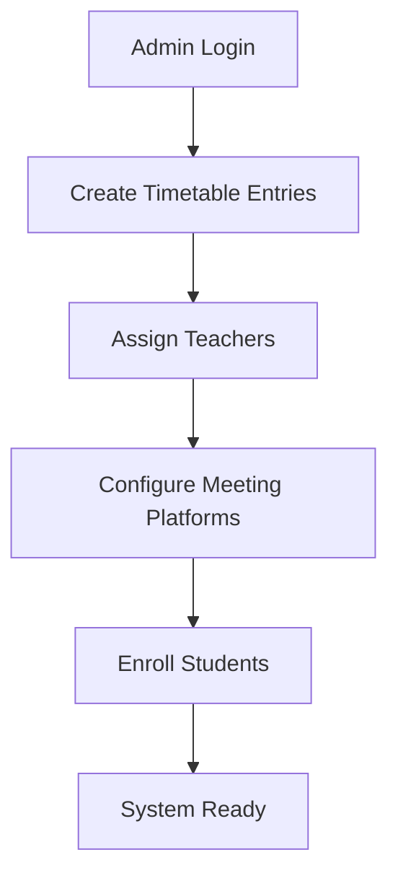
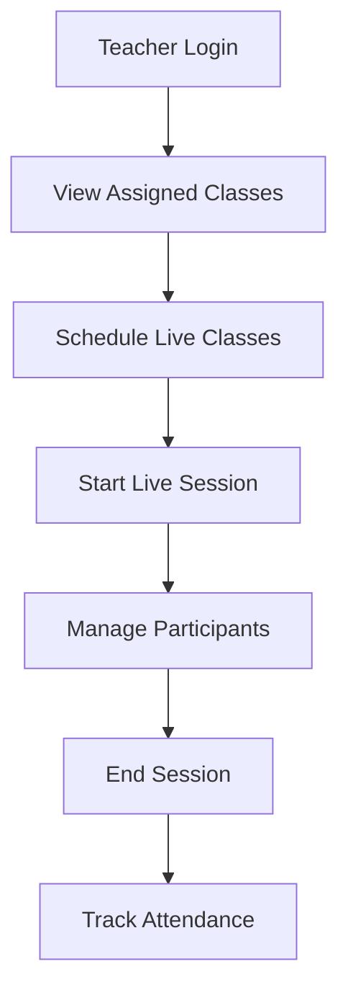
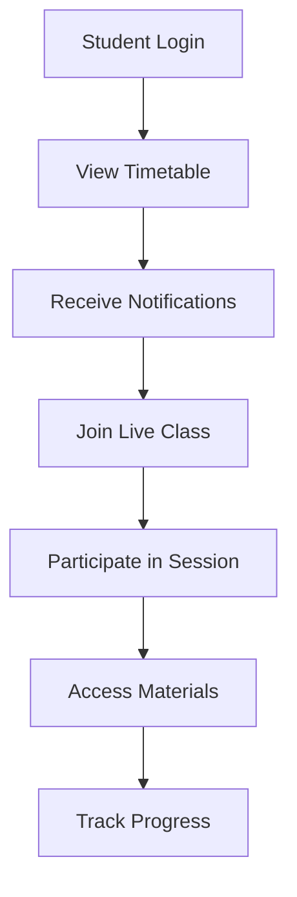

# Timetable & Live Classes Professional Workflow

## 🎯 Overview

This document outlines the comprehensive professional workflow for managing timetables and live classes in the ClassBridge Online School platform. The system provides seamless integration between scheduled classes and live sessions with real-time notifications and attendance tracking.

## 🏗️ System Architecture

### Database Schema
- **timetables**: Core timetable entries with teacher assignments
- **student_timetables**: Many-to-many relationship for student enrollments
- **live_classes**: Scheduled live class sessions
- **live_class_participants**: Attendance and participation tracking
- **class_notifications**: System notifications and reminders

### Key Features
- **Role-based Access Control**: Admin, Teacher, and Student permissions
- **Real-time Notifications**: Class reminders and live session alerts
- **Meeting Platform Integration**: Zoom, Google Meet, Microsoft Teams
- **Attendance Tracking**: Automatic participant monitoring
- **Conflict Detection**: Prevents scheduling conflicts

## 👥 User Workflows

### **1. Admin Workflow - Timetable Management**

#### **Responsibilities:**
- Create and manage class schedules
- Assign teachers to subjects and levels
- Configure meeting platforms and links
- Monitor system-wide timetable

#### **Process:**
1. **Access Admin Dashboard**
   - Navigate to `/admin/timetable`
   - View all timetable entries with filtering options

2. **Create Timetable Entry**
   - Select Level, Subject, and Teacher
   - Set day, start time, and end time
   - Configure meeting platform (Zoom, Google Meet, etc.)
   - Add room name and academic year

3. **Manage Assignments**
   - Assign students to specific timetable entries
   - Monitor student enrollment counts
   - Handle schedule conflicts

4. **System Monitoring**
   - View live class statistics
   - Monitor attendance rates
   - Generate reports

#### **Key Features:**
- **Conflict Detection**: Prevents overlapping teacher schedules
- **Bulk Operations**: Mass assignment of students
- **Export Capabilities**: Generate timetable reports
- **Real-time Updates**: Live status monitoring

### **2. Teacher Workflow - Live Class Management**

#### **Responsibilities:**
- Schedule live classes for assigned subjects
- Start and manage live sessions
- Track student attendance
- Provide meeting links

#### **Process:**
1. **Access Teacher Dashboard**
   - Navigate to `/teachers/live-classes`
   - View assigned subjects and levels

2. **Schedule Live Class**
   - Select subject and level
   - Set date, time, and duration
   - Choose meeting platform
   - Add description and materials

3. **Start Live Session**
   - Click "Start Now" when class begins
   - System generates meeting link
   - Students receive notifications

4. **Manage Session**
   - Monitor participant count
   - Track attendance
   - End session when complete

#### **Key Features:**
- **Auto-generated Links**: Meeting links created automatically
- **Attendance Tracking**: Real-time participant monitoring
- **Session Recording**: Optional class recording
- **Material Sharing**: Upload and share resources

### **3. Student Workflow - Class Access**

#### **Responsibilities:**
- View personalized timetable
- Join live classes
- Track attendance
- Access class materials

#### **Process:**
1. **Access Student Dashboard**
   - Navigate to `/students/timetable`
   - View weekly schedule
   - Check upcoming live classes

2. **Join Live Classes**
   - Click "Join Now" for ongoing sessions
   - Receive notifications for upcoming classes
   - Access meeting links automatically

3. **Track Progress**
   - View attendance history
   - Access class materials
   - Monitor academic progress

#### **Key Features:**
- **Personalized View**: Only shows enrolled classes
- **Real-time Notifications**: Class reminders and alerts
- **One-click Join**: Direct access to live sessions
- **Progress Tracking**: Attendance and performance metrics

## 🔄 Workflow Steps

### **Step 1: Admin Setup (Initial Configuration)**


### **Step 2: Teacher Class Management**


### **Step 3: Student Class Access**


## 📱 User Interface Features

### **Admin Interface**
- **Timetable Management**: Drag-and-drop scheduling
- **Teacher Assignment**: Visual assignment matrix
- **Student Enrollment**: Bulk enrollment tools
- **System Monitoring**: Real-time dashboards

### **Teacher Interface**
- **Class Dashboard**: Overview of assigned classes
- **Live Class Scheduler**: Easy scheduling interface
- **Session Management**: Start/stop controls
- **Attendance Tracker**: Real-time participant monitoring

### **Student Interface**
- **Personal Timetable**: Weekly schedule view
- **Live Class Notifications**: Real-time alerts
- **One-click Join**: Direct meeting access
- **Progress Dashboard**: Performance tracking

## 🔔 Notification System

### **Types of Notifications**
1. **Class Reminders**: 15 minutes before class
2. **Live Session Alerts**: When teacher starts class
3. **Attendance Confirmations**: After joining session
4. **Schedule Updates**: When timetable changes

### **Notification Channels**
- **In-app Notifications**: Real-time alerts
- **Email Notifications**: Daily summaries
- **SMS Alerts**: Critical updates (optional)
- **Push Notifications**: Mobile app alerts

## 🔒 Security & Privacy

### **Access Control**
- **Role-based Permissions**: Admin, Teacher, Student
- **Data Isolation**: Users only see authorized data
- **Meeting Security**: Password-protected sessions
- **Audit Logging**: Track all system activities

### **Privacy Protection**
- **Student Data**: FERPA compliance
- **Meeting Privacy**: Secure meeting links
- **Attendance Privacy**: Protected attendance records
- **Communication Security**: Encrypted messaging

## 📊 Analytics & Reporting

### **Admin Reports**
- **Attendance Analytics**: Class participation rates
- **Teacher Performance**: Session quality metrics
- **System Usage**: Platform utilization statistics
- **Student Progress**: Academic performance tracking

### **Teacher Reports**
- **Class Attendance**: Individual student participation
- **Session Analytics**: Engagement metrics
- **Material Usage**: Resource access statistics
- **Student Feedback**: Class evaluation data

### **Student Reports**
- **Personal Attendance**: Individual participation history
- **Class Performance**: Academic progress tracking
- **Material Access**: Resource utilization
- **Schedule Compliance**: Timetable adherence

## 🚀 Integration Features

### **Meeting Platform Integration**
- **Zoom API**: Automatic meeting creation
- **Google Meet**: Seamless integration
- **Microsoft Teams**: Enterprise support
- **Custom Platforms**: Extensible architecture

### **Calendar Integration**
- **Google Calendar**: Sync with personal calendar
- **Outlook Integration**: Enterprise calendar support
- **iCal Export**: Standard calendar format
- **Mobile Sync**: Smartphone calendar integration

### **Communication Tools**
- **In-app Messaging**: Real-time chat
- **Email Integration**: Automated notifications
- **SMS Alerts**: Critical updates
- **Push Notifications**: Mobile alerts

## 🛠️ Technical Implementation

### **Database Design**
```sql
-- Core tables with proper relationships
timetables (timetable_id, level_id, subject_id, teacher_id, ...)
student_timetables (student_id, timetable_id, status, ...)
live_classes (live_class_id, timetable_id, title, status, ...)
live_class_participants (live_class_id, student_id, attendance_status, ...)
```

### **API Endpoints**
- `GET /api/timetable` - Fetch timetable data
- `POST /api/timetable` - Create timetable entry
- `GET /api/live-classes` - Fetch live classes
- `POST /api/live-classes` - Create live class
- `PUT /api/live-classes/:id/start` - Start live session
- `PUT /api/live-classes/:id/end` - End live session

### **Real-time Features**
- **WebSocket Connections**: Live updates
- **Server-Sent Events**: Real-time notifications
- **Push Notifications**: Mobile alerts
- **Live Chat**: In-session communication

## 📈 Performance Optimization

### **Caching Strategy**
- **Redis Cache**: Frequently accessed data
- **CDN Integration**: Static resource delivery
- **Database Indexing**: Optimized queries
- **Memory Management**: Efficient resource usage

### **Scalability Features**
- **Horizontal Scaling**: Load balancer support
- **Database Sharding**: Large dataset handling
- **Microservices**: Modular architecture
- **Auto-scaling**: Cloud infrastructure support

## 🔧 Maintenance & Support

### **System Monitoring**
- **Health Checks**: Automated system monitoring
- **Error Tracking**: Comprehensive logging
- **Performance Metrics**: Real-time analytics
- **Alert System**: Proactive issue detection

### **Backup & Recovery**
- **Automated Backups**: Daily database backups
- **Disaster Recovery**: Business continuity planning
- **Data Archiving**: Long-term storage
- **Version Control**: Code management

## 🎯 Success Metrics

### **User Engagement**
- **Daily Active Users**: Platform usage tracking
- **Session Duration**: Class participation time
- **Feature Adoption**: Tool utilization rates
- **User Satisfaction**: Feedback and ratings

### **Academic Performance**
- **Attendance Rates**: Class participation metrics
- **Student Progress**: Academic achievement tracking
- **Teacher Effectiveness**: Session quality measures
- **Learning Outcomes**: Educational impact assessment

## 📚 Best Practices

### **For Administrators**
1. **Regular Schedule Reviews**: Weekly timetable audits
2. **Teacher Training**: Platform onboarding sessions
3. **Student Orientation**: System introduction classes
4. **Performance Monitoring**: Regular analytics review

### **For Teachers**
1. **Pre-class Preparation**: Material upload before sessions
2. **Session Management**: Proper start/end procedures
3. **Student Engagement**: Interactive teaching methods
4. **Attendance Tracking**: Regular participation monitoring

### **For Students**
1. **Schedule Awareness**: Regular timetable checking
2. **Pre-class Preparation**: Material review before sessions
3. **Active Participation**: Engaging in live classes
4. **Progress Monitoring**: Regular performance review

## 🔮 Future Enhancements

### **Planned Features**
- **AI-powered Scheduling**: Intelligent timetable optimization
- **Advanced Analytics**: Predictive performance insights
- **Mobile App**: Native smartphone application
- **Virtual Reality**: Immersive learning experiences

### **Integration Roadmap**
- **LMS Integration**: Learning Management System support
- **Assessment Tools**: Automated testing integration
- **Parent Portal**: Family communication platform
- **Third-party APIs**: External service integration

---

This comprehensive workflow ensures a professional, scalable, and user-friendly system for managing timetables and live classes in the ClassBridge Online School platform.
